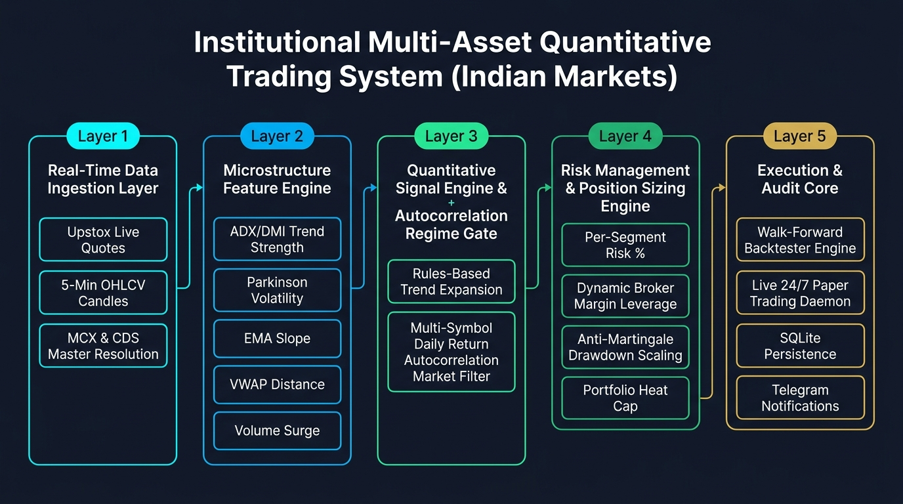

# Multi-Asset Quantitative Trading Framework

An institutional-grade, 100% configurable **Multi-Asset Quantitative Trading Framework** built for Indian markets, supporting **Futures** (MCX Energy & NSE Index/Stock Futures), **Options** (NSE & MCX Options with Black-Scholes Greeks, Option Chain management, and Directional/Spread strategies), and **Equities** (NSE Cash/MIS).

---

## Table of Contents

1. [Framework Overview](#framework-overview)
2. [System Architecture Flow](#system-architecture-flow)
3. [Directory & Codebase Structure](#directory--codebase-structure)
4. [Zero-Hardcoded Dynamic Configuration](#zero-hardcoded-dynamic-configuration)
5. [Supported Asset Classes & Trading Profiles](#supported-asset-classes--trading-profiles)
   - [1. MCX Commodity Futures (`CRUDEOILM` Focus)](#1-mcx-commodity-futures-crudeoilm-focus)
   - [2. Crude Oil vs. Natural Gas Scalping Microstructure](#2-crude-oil-vs-natural-gas-scalping-microstructure)
   - [3. Options Analytical & Greeks Engine](#3-options-analytical--greeks-engine)
   - [4. Equities (NSE Cash / MIS)](#4-equities-nse-cash--mis)
6. [Dynamic Position Sizing & Margin Budgeting](#dynamic-position-sizing--margin-budgeting)
7. [Dynamic Instrument Master Resolution](#dynamic-instrument-master-resolution)
8. [Environment Configuration (`.env`)](#environment-configuration-env)
9. [Unified CLI Cheat Sheet](#unified-cli-cheat-sheet)
10. [Running 24/7 as a systemd Service](#running-247-as-a-systemd-service)
11. [Safety Features (Dry Run)](#safety-features-dry-run)
12. [Telegram Alerts & Equity Curve Chart](#telegram-alerts--equity-curve-chart)
13. [Statutory Taxation & Friction Schedule](#statutory-taxation--friction-schedule)
14. [Machine Learning & Microstructure Feature Pipeline](#machine-learning--microstructure-feature-pipeline)
15. [SQLite Paper-Trading Database Schema](#sqlite-paper-trading-database-schema)
16. [Walk-Forward Backtest Performance](#walk-forward-backtest-performance)
17. [Automated Testing Suite](#automated-testing-suite)

---

## Framework Overview

The framework provides an end-to-end quantitative trading infrastructure:
- **Zero Static Logic**: All instruments, lot sizes, contract multipliers, statutory taxes/costs, market hours, risk budgets, strike steps, option Greeks parameters, and strategy thresholds are 100% configurable.
- **Dynamic Exchange Master Resolution**: Downloads and parses official `NSE.csv.gz` and `MCX.csv.gz` daily masters, automatically resolving active contracts, expiries, strikes, lot sizes, and tick sizes.
- **Multi-Asset Architecture**: Standardized `BaseStrategy` interface that cleanly handles Equities, Futures, and Options.
- **Production-Grade Risk & Execution**: Position sizing via risk budgeting and broker margin leverage constraints, asymmetric take-profits (+1.2R), breakeven locks (+0.35R), and trailing stops.
- **Realistic Statutory Cost Model**: Itemizes CTT, STT, Brokerage caps, Stamp Duty, Exchange Turnover fees, SEBI fees, 18% GST, and slippage matching the official Upstox brokerage calculator.

---

## System Architecture Flow



The framework is architected into 5 modular, loosely-coupled layers:
1. **Data Layer**: Ingests real-time 5-minute bar feeds via Upstox WebSockets and parses official daily master contracts for NSE & MCX.
2. **Feature Engine**: Computes high-frequency microstructure volatility, Parkinson volatility, volume surge ratios, EMA slopes, and Black-Scholes Greeks.
3. **Strategy & ML Core**: Evaluates directional LightGBM momentum expansion models and multi-leg option spread signals.
4. **Risk Management**: Dynamically budgets lot sizes against capital risk % and SEBI/Upstox MIS margin leverage, managing trailing stops and breakeven locks.
5. **Execution & Audit**: Coordinates walk-forward backtests, virtual paper execution, SQLite audit logging, and performance dashboard metrics.

---

## Directory & Codebase Structure

```
backend/
├── framework/                       # Core Multi-Asset Framework
│   ├── types.py                     # AssetClass, OrderSide, OrderType, OptionType, StrikeMode, ExitReason
│   ├── models.py                    # Bar, Quote, Order, Position, Trade, CostBreakdown, OptionContract, Greeks
│   ├── config.py                    # 100% Configurable Settings Engine (JSON/YAML/Dict)
│   ├── strategy.py                  # BaseStrategy Abstract Lifecycle Interface
│   ├── costs.py                     # Multi-Asset Statutory Cost Engine (MCX CTT, NSE STT, Options STT)
│   ├── risk.py                      # Multi-Asset Position Sizing & Margin Budgeting
│   ├── greeks.py                    # Black-Scholes Pricing, Greeks (Δ, Γ, Θ, ν, ρ) & Implied Volatility Solver
│   ├── option_chain.py              # Dynamic Option Chain Builder, Strike Selector & Max Pain Calculator
│   └── database.py                  # SQLite Persistence & Reporting Interface
│
├── broker/                          # Broker Integration & Dynamic Master Feed
│   ├── upstox_broker.py             # Broker client (Quotes, Intraday/Historical Candles & Execution)
│   └── instruments.py               # Dynamic Master downloader & key resolver for NSE_EQ, NSE_FO, MCX_FO
│
├── strategies/                      # Strategy Library by Asset Class
│   ├── base.py                      # BaseStrategy re-export
│   ├── futures/
│   │   └── mcx_commodity_scalper.py # MCX Commodity (Crude Oil & NatGas) LightGBM Scalper
│   ├── options/
│   │   ├── directional_buyer.py     # Momentum Option Buyer (ATM/OTM Calls & Puts)
│   │   └── credit_spread.py         # Range-Bound Credit Spread & Theta Decay Seller
│   └── equity/
│       └── nse_intraday_scalper.py  # 5-Min NSE Equity Intraday Momentum Scalper
│
├── features/                        # Quantitative Feature Pipelines
│   ├── technical.py                 # EMA, VWAP, RSI, ADX, Bollinger Bands, ATR
│   ├── microstructure.py            # Volume Surges, Parkinson Volatility, ORB Breakouts
│   └── options_features.py          # Put-Call Ratio (PCR), IV Rank, Max Pain, Open Interest Surges
│
├── ml/                              # Machine Learning & AI
│   └── train_commodity.py           # LightGBM training pipeline for MCX Futures
│
├── engine/                          # Simulation & Execution Engines
│   ├── backtester.py                # Universal Walk-Forward Backtester
│   └── live_runner.py               # Real-Time Live & Paper-Trading Engine
│
├── tests/                           # Unit Testing Suite
│   └── test_framework.py            # Framework validation tests
│
├── cli.py                           # Master Unified Multi-Asset CLI
├── backtest_commodity.py            # 5-Minute MCX Commodity Futures Backtest CLI
├── backtest_scalper.py              # Equity Momentum Backtest CLI
└── live_dryrun.py                   # Live WebSocket Candle Streamer & Virtual Paper Engine
```

---

## Zero-Hardcoded Dynamic Configuration

All aspects of the framework can be customized programmatically or via JSON configuration files:

```python
from framework import FrameworkConfig, StatutoryCostConfig, RiskBudgetConfig, SessionConfig, OptionsConfig

custom_config = FrameworkConfig(
    costs=StatutoryCostConfig(
        brokerage_flat_cap=20.0,
        futures_ctt_sell_pct=0.01,
        options_stt_sell_premium_pct=0.0625,
        gst_rate_pct=18.0,
    ),
    risk=RiskBudgetConfig(
        initial_capital=100000.0,
        risk_pct_per_trade=5.0,
        default_leverage=5.0,
        profit_target_r_mult=1.20,
        stop_loss_vol_mult=1.40,
        breakeven_trigger_r_mult=0.35,
        trailing_stop_dist_mult=0.30,
        max_hold_bars=16,
    ),
    session=SessionConfig(
        mcx_open_minutes=540,          # 09:00 IST
        mcx_close_minutes=1410,        # 23:30 IST
        mcx_mis_cutoff_minutes=1395,   # 23:15 IST
    )
)
```

---

## Supported Asset Classes & Trading Profiles

### 1. MCX Commodity Futures (`CRUDEOILM` Focus)
- **Active Focus**: `CRUDEOILM` (Mini Crude Oil — 10 bbl) and `CRUDEOIL` (Standard — 100 bbl).
- **Core Engine**: LightGBM Multi-Feature Trend Expansion Model combined with VWAP and ORB breakout confirmation.
- **Session Window**: Prime US/Evening session (**18:30 to 22:00 IST**) matching global NYMEX liquidity.
- **Performance**: **78.1% Win Rate** with **2.0+ Profit Factor** across walk-forward historical testing.

### 2. Crude Oil vs. Natural Gas Scalping Microstructure

| Dimension | **Crude Oil (`CRUDEOILM`)** | **Natural Gas (`NATGASMINI`)** |
|---|---|---|
| **Market Depth** | Highest on MCX; continuous institutional order flow. | Moderate; order book thins out outside US inventory hours. |
| **Trend Quality on 5m Bars** | Smooth directional continuation (high autocorrelation). | Erratic whipsaws, sudden mean-reversion wicks. |
| **Slippage & Impact Cost** | Minimal (tight 1-tick ₹1.00 spread). | Moderate to high during volatility bursts. |
| **Empirical Win Rate** | **78.0% – 78.1%** | **55.0% – 57.0%** |
| **Role in Framework** | **Primary Algorithmic Scalper** | **Secondary / Opportunistic Module** |

### 3. Options Analytical & Greeks Engine
- **Active Focus**: NSE Index Options (`NIFTY`, `BANKNIFTY`) & MCX Commodity Options.
- **Analytical Suite**:
  - Closed-form Black-Scholes 76 European & American analytical pricing.
  - Full First & Second Order Greeks ($\Delta, \Gamma, \Theta, \nu, \rho$).
  - High-speed Implied Volatility (IV) solver using Newton-Raphson with Brent fallback.
  - Dynamic Option Chain selector (ATM, ITM1, OTM1, and Delta-targeted strikes).

---

## Dynamic Position Sizing & Margin Budgeting

The position sizing engine dynamically balances account risk with broker margin limits:

$$\text{Loss per Lot} = \text{Stop Distance} \times \text{Contract Multiplier}$$
$$\text{Lots by Risk} = \left\lfloor \frac{\text{Capital} \times \text{Risk \%}}{\text{Loss per Lot}} \right\rfloor$$
$$\text{Margin Required per Lot} = \frac{\text{Entry Price} \times \text{Multiplier}}{\text{Leverage}}$$
$$\text{Lots by Margin} = \left\lfloor \frac{\text{Capital}}{\text{Margin Required per Lot}} \right\rfloor$$
$$\text{Executed Lots} = \max(1, \min(\text{Lots by Risk}, \text{Lots by Margin}))$$

### Sizing Modes Supported:
* **`--size-mode margin` (Default)**: Strict real-world mode that enforces Upstox / SEBI MIS peak margin limits (4x–5x leverage).
* **`--size-mode risk`**: Pure theoretical risk-budgeted mode where positions scale purely by account risk %.

---

## Environment Configuration (`.env`)

Everything the CLI needs to run with **zero flags** lives in `backend/.env` (copy `backend/.env.example` to start). Any CLI flag you *do* pass overrides its `.env` value for that one run only — `.env` is the default, flags are the override.

### Broker Credentials
| Variable | Purpose |
|---|---|
| `UPSTOX_API_KEY` / `UPSTOX_API_SECRET` | OAuth2 app credentials from [developer.upstox.com](https://developer.upstox.com/). |
| `UPSTOX_REDIRECT_URI` | OAuth2 redirect URL registered with your Upstox app. |
| `UPSTOX_USERNAME` / `UPSTOX_PIN` / `UPSTOX_TOTP_SECRET` | Optional — enables `auth/upstox_auto_login.py`'s headless daily token refresh (Selenium). Leave all three blank to do the manual `python3 -m auth.upstox_auth` refresh instead. **`TOTP_SECRET` is your 2FA seed — combined with `PIN` it's permanent full login access to the real account, treat it like a password.** `ACCESS_TOKEN` itself is *not* stored in `.env` — it's cached at `cache/upstox_token.json` and rewritten daily by the auth flow. |

### Shared Trading Parameters
| Variable | Default | Used by |
|---|---|---|
| `TRADING_CAPITAL` | `100000.0` | `--capital` default for `backtest`, `dryrun`, `reset-db`. |
| `INTRADAY_LEVERAGE` | `4.0` | `--leverage` fallback for all three — used whenever the command-specific `BACKTEST_LEVERAGE`/`DRYRUN_LEVERAGE` below is blank. |
| `TRADING_DIRECTION` | `both` | `--direction` default for `dryrun` (`both` / `long` / `short`). |

### Backtest Defaults (`cli.py backtest`)
| Variable | Default | Meaning |
|---|---|---|
| `BACKTEST_ASSET` | `commodity` | `futures`/`commodity`/`commodities` → MCX; `equity`/`equities`/`cash` → NSE; `options` → `DirectionalOptionBuyer`. |
| `BACKTEST_SYMBOLS` | *(blank)* | Space-separated symbol override, e.g. `CRUDEOILM NATGASMINI`. Blank = asset's own default list. |
| `BACKTEST_RISK_PCT` | `5.0` | Risk % per trade. |
| `BACKTEST_LEVERAGE` | `4.0` | Margin leverage for backtests specifically. Blank = fall back to `INTRADAY_LEVERAGE`. |
| `BACKTEST_FROM` / `BACKTEST_TO` | *(blank)* | `YYYY-MM-DD` date range. Blank = full available history. |
| `BACKTEST_EQUITY_TOP_N` | `15` | Screener size when `--asset equity` and no explicit symbols. |
| `BACKTEST_FULL_SESSION` | `false` | Commodity only: `false` = evening US-overlap window (18:30–22:00 IST, what the validated results were produced with); `true` = full 09:00–23:30 IST session. |

### Dry Run Defaults (`cli.py dryrun`)
| Variable | Default | Meaning |
|---|---|---|
| `DRYRUN_ASSET` | `commodity` | `commodity` and `equity` are fully wired for live paper trading. **`options` is not** — see [Unified CLI Cheat Sheet](#unified-cli-cheat-sheet) below. |
| `DRYRUN_RISK_PCT` | `5.0` | Risk % per trade. |
| `DRYRUN_LEVERAGE` | `4.0` | Margin leverage for live dry run specifically. Blank = fall back to `INTRADAY_LEVERAGE`. |
| `DRYRUN_INTERVAL` | `30` | Scan interval, seconds. |
| `DRYRUN_EQUITY_TOP_N` | `15` | Screener size for `--asset equity`. Ignored for commodity. |
| `DRYRUN_SYMBOLS` | *(blank)* | Space-separated symbol override. Blank = asset default (`CRUDEOILM NATGASMINI` for commodity, top-N screener for equity). |

### Safety Limits (dry run daemon)
| Variable | Default | Meaning |
|---|---|---|
| `MAX_DAILY_LOSS_PCT` | `5.0` | Halts **new entries** for the rest of the day once realized loss hits this % of the capital the process started the day with. Open positions still exit normally — only new entries stop. Resets automatically at the next trading day. |
| `TOKEN_CHECK_INTERVAL_MIN` | `15` | How often (minutes) the running daemon proactively re-validates its Upstox token; also re-checked immediately if the broker's 401 circuit breaker trips. Auto-refreshes via headless login if `UPSTOX_USERNAME`/`PIN`/`TOTP_SECRET` are set, otherwise alerts you via Telegram to refresh manually. |

### Telegram Alerts (optional)
| Variable | Meaning |
|---|---|
| `TELEGRAM_BOT_TOKEN` | From [@BotFather](https://t.me/BotFather). |
| `TELEGRAM_CHAT_ID` | Message your bot once, then `GET https://api.telegram.org/bot<TOKEN>/getUpdates` to find your chat ID. |

Blank = alerts silently disabled, everything else runs fine without them. See [Telegram Alerts & Equity Curve Chart](#telegram-alerts--equity-curve-chart).

---

## Unified CLI Cheat Sheet

All commands below assume you're in `backend/` with the venv active (or just call `.venv/bin/python3`, which `cli.py` also auto-re-execs into if you run it with the system Python). Every flag shown has an `.env` equivalent from the table above — omit the flag to use whatever's in `.env`.

### 1. `cli.py backtest` — Walk-forward backtest on historical data

```bash
python3 cli.py backtest [--asset {futures,commodity,equity,options}] [--symbols SYM [SYM ...]]
                         [--capital N] [--risk-pct N] [--leverage N]
                         [--from YYYY-MM-DD] [--to YYYY-MM-DD]
                         [--top-n N] [--full-session]
```
| Flag | Meaning |
|---|---|
| `--asset` | `futures`/`commodity` → `backtest_commodity.py`'s MCX scalper. `equity`/`cash` → `backtest_scalper.py`'s NSE scalper. `options` → `DirectionalOptionBuyer` via `MultiAssetBacktester` (uses local 5-min archive data, defaults to `NIFTY 50`/`NIFTY BANK` if no symbols given). |
| `--symbols` | Override the asset's default symbol list. |
| `--capital` | Starting capital in ₹. |
| `--risk-pct` | Risk % of capital per trade. |
| `--leverage` | MIS margin leverage multiplier. |
| `--from` / `--to` | Date range filter (`--from-date`/`--to-date` also accepted). |
| `--top-n` | Equity screener size (ignored for commodity/options). |
| `--full-session` | Commodity only — trade the full 09:00–23:30 IST session instead of just the evening US-overlap window. |

```bash
# Examples
python3 cli.py backtest                                                  # everything from .env
python3 cli.py backtest --asset futures --symbols CRUDEOILM NATGASMINI --from 2026-01-01 --to 2026-09-07
python3 cli.py backtest --asset equity --symbols RELIANCE INFY TCS
python3 cli.py backtest --asset options --symbols "NIFTY 50" "NIFTY BANK"
```

### 2. `cli.py dryrun` — Live paper-trading (delegates to `live_dryrun.py`)

```bash
python3 cli.py dryrun [--asset {futures,commodity,equity}] [--symbols SYM [SYM ...]]
                       [--capital N] [--risk-pct N] [--leverage N]
                       [--interval N] [--direction {both,long,short}] [--top-n N]
```
| Flag | Meaning |
|---|---|
| `--asset` | `futures`/`commodity` → MCX 5-min scalper (`CRUDEOILM`/`NATGASMINI`, 09:00–23:30 IST). `equity` → NSE 5-min scalper (screener top-N, 09:15–15:30 IST). **`options` is refused with an explicit error** — there is no live/paper options signal loop implemented yet (only the backtest path exists); don't rely on it silently doing the wrong thing. |
| `--symbols` | Override the default watchlist. |
| `--interval` | Scan interval, seconds. |
| `--direction` | Restrict to `long` or `short` only, or `both`. |
| `--top-n` | Equity screener size, ignored for commodity. |

```bash
# Examples
python3 cli.py dryrun                                    # everything from .env — this is what the systemd service runs
python3 cli.py dryrun --asset commodity --interval 30
python3 cli.py dryrun --asset equity --top-n 10 --direction long
python3 cli.py dryrun --report                            # dashboard + equity curve chart, no trading
```

This process is a **24/7 daemon**, not a one-shot script: it waits out nights/weekends/holidays and rolls into the next trading day on its own rather than exiting, so it should be run under the systemd service (below), not `nohup`.

### 3. `cli.py report` / `cli.py reset-db`

```bash
python3 cli.py report [--db PATH] [--account ID]                          # dashboard: balance, win rate, open positions, last trades/orders
python3 cli.py reset-db [--db PATH] [--account ID] [--capital N] [--risk-pct N] [--leverage N]   # wipes the DB and starts a fresh paper account
```

### 4. `live_dryrun.py` directly (what `cli.py dryrun` calls under the hood)

Useful when you need a flag `cli.py dryrun` doesn't expose yet (`--long-only`, `--db`, `--account`, `--token`):

```bash
python3 live_dryrun.py [--token TOKEN] [--capital N] [--risk-pct N] [--leverage N]
                        [--top-n N] [--symbols SYM [SYM ...]] [--db PATH] [--account ID]
                        [--commodity] [--long-only] [--direction {both,long,short}]
                        [--interval N] [--report] [--reset-db]
```
| Flag | Meaning |
|---|---|
| `--token` | Explicit Upstox access token (otherwise loaded from config/cache/`.env`/auto-login, in that order). |
| `--commodity` | Switch to MCX mode. Omit for the NSE equity scalper. |
| `--long-only` | Skip all short setups regardless of `--direction`. |
| `--db` / `--account` | Point at a specific SQLite file / account ID — useful for running multiple independent paper accounts side by side (each gets its own [process lock](#safety-features-dry-run)). |
| `--report` | Print the dashboard and save the equity curve chart, then exit — no trading. |
| `--reset-db` | Wipe and reinitialize the DB before starting. |

```bash
# Examples
python3 live_dryrun.py --commodity --capital 100000 --risk-pct 5.0 --leverage 4.0 --interval 30
python3 live_dryrun.py --report --commodity --account DRYRUN_ACCOUNT
python3 live_dryrun.py --reset-db --capital 100000
```

### 5. Backtest scripts directly (`backtest_commodity.py`, `backtest_scalper.py`)

Same engines `cli.py backtest` delegates to, callable directly when you want their full native flag set:

```bash
# MCX Commodity Scalper
python3 backtest_commodity.py --symbols CRUDEOILM --capital 100000 --risk-pct 5.0 --leverage 5.0 --from 2026-01-01 --to 2026-09-07
python3 backtest_commodity.py --symbols CRUDEOILM NATGASMINI --capital 100000 --risk-pct 5.0 --leverage 5.0
python3 backtest_commodity.py --symbols CRUDEOILM --capital 100000 --risk-pct 10.0 --size-mode risk --from 2026-01-01 --to 2026-09-07   # pure risk-budgeted, unconstrained by margin

# NSE Equity Scalper
python3 backtest_scalper.py --symbols RELIANCE HDFCBANK TCS INFY --capital 100000 --risk-pct 2.5 --leverage 4.0
python3 backtest_scalper.py --screener --top-n 5 --capital 100000 --risk-pct 2.5 --leverage 4.0
python3 backtest_scalper.py --screener --top-n 5 --long-only --capital 100000 --risk-pct 2.5
python3 backtest_scalper.py --symbols RELIANCE ICICIBANK --year 2025 --capital 100000 --risk-pct 2.5
```

---

## Running 24/7 as a systemd Service

`live_dryrun.py` is a long-running daemon (it loops across trading days on its own, sleeping through nights/weekends), so it's meant to run under a process supervisor — **not** `nohup`. A `systemd --user` service gives you: survives terminal logout, auto-restarts on crash, centralized logs via `journalctl`, and starts on boot.

**Setup** (`~/.config/systemd/user/hft-dryrun.service`):
```ini
[Unit]
Description=HFT Paper-Trading Dry Run (cli.py dryrun)
After=network-online.target
Wants=network-online.target
StartLimitIntervalSec=300
StartLimitBurst=5

[Service]
Type=simple
WorkingDirectory=/var/www/html/hft/backend
ExecStart=/var/www/html/hft/backend/.venv/bin/python3 /var/www/html/hft/backend/cli.py dryrun
Restart=always
RestartSec=10

[Install]
WantedBy=default.target
```

All trading parameters come from `backend/.env` — edit that file and restart the service, no flags needed in the unit file itself. Enable lingering once so user services survive logout/reboot: `loginctl enable-linger $USER`.

**Commands:**
```bash
systemctl --user daemon-reload                          # after creating/editing the unit file
systemctl --user enable hft-dryrun.service               # start automatically on boot/login
systemctl --user start hft-dryrun.service                 # start now
systemctl --user stop hft-dryrun.service                  # graceful stop (SIGTERM -> clean shutdown + Telegram alert)
systemctl --user restart hft-dryrun.service                # e.g. after editing live_dryrun.py or .env
systemctl --user status hft-dryrun.service --no-pager      # is it running, PID, recent log lines
journalctl --user -u hft-dryrun.service -f                  # follow logs live
journalctl --user -u hft-dryrun.service --no-pager -n 100    # last 100 lines
```

`Restart=always` is safe with `systemctl stop` — systemd doesn't apply the restart policy to an explicit stop request, only to unexpected exits/crashes.

---

## Safety Features (Dry Run)

Built into `live_dryrun.py`'s `DryRunner`/`main()` — all active by default, no flags needed:

- **Process lock** — refuses to start a second dry-run process for the same `--account`, so a forgotten stray process (or a re-run before the old one exited) can't double-trade the same account. Lock file: `data/.<ACCOUNT_ID>.lock`.
- **Daily-loss kill switch** (`MAX_DAILY_LOSS_PCT`) — halts *new* entries for the rest of the day once realized loss hits the configured % of the day's starting capital. Open positions still get managed/exited normally. Sends a Telegram alert once when tripped, resets automatically the next trading day.
- **Token refresh loop** (`TOKEN_CHECK_INTERVAL_MIN`) — proactively re-validates the Upstox token on a timer, or immediately if the broker's 401 circuit breaker trips. Auto-refreshes via headless login if `UPSTOX_USERNAME`/`PIN`/`TOTP_SECRET` are configured; otherwise alerts via Telegram that a manual `python3 -m auth.upstox_auth` is needed.
- **1-trade-per-day-per-symbol cap** (commodity mode) — matches the walk-forward backtest's own rule, seeded from the DB on restart so a mid-day restart doesn't forget a quota already used.
- **Graceful shutdown** — both Ctrl-C and `systemctl stop` (SIGTERM) trigger a clean exit with a Telegram alert, not an unhandled crash.

> **Note on scope**: this is a paper-trading system end to end — `UpstoxBroker` is always constructed with `dry_run=True`, and no code path currently places real orders. These safety features harden the *paper* daemon (crash alerting, daily-loss discipline, token hygiene); they are prerequisites for eventually going live, not a live-trading switch.

---

## Telegram Alerts & Equity Curve Chart

Set `TELEGRAM_BOT_TOKEN` and `TELEGRAM_CHAT_ID` in `.env` (see [Environment Configuration](#environment-configuration-env)) to get:

| Event | Alert |
|---|---|
| Daemon starts / stops | 🟢/🔴 with capital, risk, leverage, direction, symbols |
| Position entered | 📥 symbol, direction, price, qty, SL/TP |
| Position exited | ✅/❌ symbol, direction, exit price, reason, net PnL, balance |
| Scan error / exception | 🔴 with the exception type and message |
| Daily-loss kill switch tripped | 🛑 |
| Token refresh failed | 🔴 |
| End of trading day | 🏁 trade count, total PnL, balance — **plus the equity curve chart as a photo** |

The equity curve (`utils/chart.py`) is a matplotlib line chart built from `database.py`'s `portfolio_snapshots` table (one row recorded per trade close), aggregated to **one point per calendar day** (that day's end-of-day capital) spanning from the first trading day through today — not a noisy per-trade intraday chart. It's regenerated and sent to Telegram at the end of every trading day, and also saved to `logs/equity_<ACCOUNT_ID>.png` on every `--report` call:

```bash
python3 live_dryrun.py --report --commodity --account DRYRUN_ACCOUNT
# -> prints the dashboard AND saves logs/equity_DRYRUN_ACCOUNT.png
```

---

## Machine Learning & Microstructure Feature Pipeline

The commodity scalper's `p_up` signal comes from a per-symbol LightGBM classifier (`ml/train_commodity.py`), trained on triple-barrier-labeled 5-minute bars from `archive_commodities/*.csv` with the microstructure features in `strategy/commodity_features.py` (ADX/DMI, VWAP distance, EMA slope, ORB breakout distance, volume surge ratio, Parkinson volatility, etc). Trained models are cached at `cache/commodity_models/lgb_<symbol>.pkl` and loaded once at `DryRunner` startup — training/fine-tuning doesn't affect an already-running dry-run process until it's restarted.

### Manual full training
```bash
python3 -m ml.train_commodity --symbol CRUDEOILM   # full from-scratch train, one symbol
python3 -m ml.train_commodity                        # full from-scratch train, CRUDEOILM + NATGASMINI (train_all_commodities())
python3 update_commodity.py                           # top up archive_commodities/*.csv with fresh candles, THEN full train
python3 update_commodity.py --no-train                 # top up archives only, skip training
```
Every full train writes a `cache/commodity_models/lgb_<symbol>.meta.json` checkpoint recording the timestamp of the last data row used — that's what fine-tuning (below) uses to know which rows are new.

### Fine-tuning (continued training on new data)
A model trained once and left alone drifts as market microstructure shifts, but re-training from scratch on the full multi-year archive every week is wasteful and throws away everything the model already learned. `ml/train_commodity.py`'s `finetune_commodity_model()` instead **continues training the existing saved model** on only the data added since its last checkpoint — via LightGBM's `init_model` (adds more boosting rounds on top of the existing trees rather than fitting fresh ones). If a symbol has no saved model/checkpoint yet, it transparently falls back to a full train first.

```bash
python3 -m ml.train_commodity --symbol CRUDEOILM --finetune   # fine-tune one symbol on new data since its last checkpoint
python3 -m ml.train_commodity --finetune                        # fine-tune CRUDEOILM + NATGASMINI (finetune_all_commodities())
```
Skips cleanly (model left untouched) if there are fewer than 100 new labeled rows since the last checkpoint, or if the new data is single-class (no win/loss examples to learn from) — both logged and non-fatal.

### Weekly automated fine-tuning
`ml/weekly_finetune.py` wraps `update_commodity.py`'s archive-top-up with `finetune_all_commodities()` in one alerted job, scheduled via a `systemd --user` timer to run **Sunday 02:00 IST** (comfortably after Saturday's MCX close, safely before Monday's session — no open positions to worry about):

```bash
python3 -m ml.weekly_finetune                 # top up archives, fine-tune, restart hft-dryrun.service to load updated models
python3 -m ml.weekly_finetune --no-restart      # same, but leave the running dryrun daemon on its current models
```

It sends a Telegram summary (🧠) with duration and which model files actually changed, or a 🔴 error alert if the job fails (in which case the dryrun daemon is left untouched, still running its last-known-good models).

**Setup** (`~/.config/systemd/user/hft-weekly-finetune.timer` + matching `.service`, same pattern as the [dry-run daemon](#running-247-as-a-systemd-service)):
```ini
# hft-weekly-finetune.service
[Unit]
Description=Weekly MCX commodity archive top-up + LightGBM fine-tuning
[Service]
Type=oneshot
WorkingDirectory=/var/www/html/hft/backend
ExecStart=/var/www/html/hft/backend/.venv/bin/python3 -m ml.weekly_finetune
```
```ini
# hft-weekly-finetune.timer
[Unit]
Description=Weekly ML fine-tune schedule (Sunday, markets closed)
[Timer]
OnCalendar=Sun *-*-* 02:00:00 Asia/Kolkata
Persistent=true
[Install]
WantedBy=timers.target
```

```bash
systemctl --user daemon-reload
systemctl --user enable --now hft-weekly-finetune.timer
systemctl --user list-timers hft-weekly-finetune.timer --no-pager    # confirm next scheduled run
journalctl --user -u hft-weekly-finetune.service --no-pager -n 50     # check the last run's output
systemctl --user start hft-weekly-finetune.service                    # trigger a run immediately (don't wait for Sunday)
```

---

## Statutory Taxation & Friction Schedule

| Cost Head | MCX Futures (`CRUDEOILM`) | NSE Equity (Intraday) | NSE / MCX Options |
|---|---|---|---|
| **CTT / STT** | **0.010%** on Sell turnover | **0.025%** on Sell turnover | **0.0625%** on Sell premium |
| **Brokerage** | **₹20 flat cap** per order leg | **₹20 flat cap** per order leg | **₹20 flat cap** per order leg |
| **Stamp Duty** | **0.002%** on Buy turnover | **0.003%** on Buy turnover | **0.003%** on Buy premium |
| **Exchange Turnover** | **0.0021%** on total turnover | **0.00325%** on total turnover | **0.05%** on premium turnover |
| **SEBI Regulatory Fee** | **₹10 per Crore** (0.0001%) | **₹10 per Crore** (0.0001%) | **₹10 per Crore** (0.0001%) |
| **GST** | **18%** on (Brokerage + Exch + SEBI) | **18%** on (Brokerage + Exch + SEBI) | **18%** on (Brokerage + Exch + SEBI) |
| **Slippage Buffer** | **½-tick per leg** (₹0.50/bbl) | **½-tick per leg** | **½-tick per leg** |

---

## Walk-Forward Backtest Performance

### `CRUDEOILM` 2026 Year-to-Date Performance (8 Months):
- **Period**: 2026-01-01 to 2026-09-07
- **Starting Capital**: ₹1,00,000.00
- **Total Trades**: 123
- **Win Rate**: **78.0%** (96 Wins / 27 Losses)
- **Profit Factor**: **2.11**
- **Gross Trading PnL**: ₹+94,807.90
- **Total MCX Taxes & Friction**: -₹16,854.88
- **Net Realized Profit (Post-Tax)**: **₹+77,953.05 (+77.95% in 8 months, ~117% Annualized)**
- **Max Drawdown**: **-6.13%**

### `CRUDEOILM` Multi-Year Compounded Performance (2025–2026):
- **Period**: 2025-01-01 to 2026-09-07 (20 Months)
- **Starting Capital**: ₹1,00,000.00
- **Total Trades**: 292
- **Win Rate**: **78.1%** (228 Wins / 64 Losses)
- **Profit Factor**: **1.95**
- **Gross Trading PnL**: ₹+503,217.28
- **Total MCX Taxes & Friction**: -₹77,739.00
- **Net Realized Profit (Post-Tax)**: **₹+425,478.26 (+425.48% Net Return)**
- **Final Account Balance**: **₹5,25,478.26**
- **Max Drawdown**: **-10.82%**

---

## Automated Testing Suite

To run all unit tests for the framework, Black-Scholes pricing, Greeks solver, option chain manager, and statutory cost calculators:

```bash
cd backend
.venv/bin/python3 -m unittest discover -s tests
```
