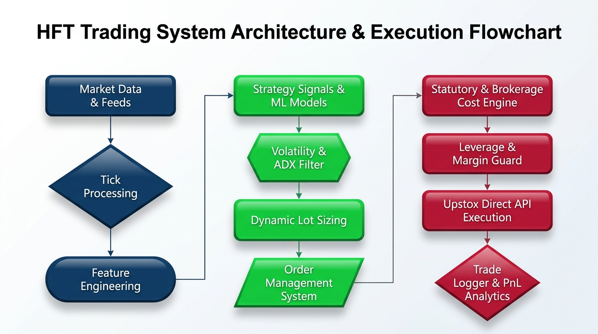

# Multi-Asset Quantitative Trading Framework

An institutional-grade, 100% configurable **Multi-Asset Quantitative Trading Framework** built for Indian markets, supporting **Futures** (MCX Energy & NSE Index/Stock Futures), **Options** (NSE & MCX Options with Black-Scholes Greeks, Option Chain management, and Directional/Spread strategies), and **Equities** (NSE Cash/MIS).


---

## Table of Contents

1. [Framework Overview](#framework-overview)
2. [System Architecture Flow](#system-architecture-flow)
3. [Directory & Codebase Structure](#directory--codebase-structure)
4. [Zero-Hardcoded Dynamic Configuration](#zero-hardcoded-dynamic-configuration)
5. [Supported Asset Classes & Trading Profiles](#supported-asset-classes--trading-profiles)
   - [1. MCX Commodity Futures (`CRUDEOILM` Focus)](#1-mcx-commodity-futures-crudeoilm-focus)
   - [2. Crude Oil vs. Natural Gas Scalping Microstructure](#2-crude-oil-vs-natural-gas-scalping-microstructure)
   - [3. Options Analytical & Greeks Engine](#3-options-analytical--greeks-engine)
   - [4. Equities (NSE Cash / MIS)](#4-equities-nse-cash--mis)
6. [Dynamic Position Sizing & Margin Budgeting](#dynamic-position-sizing--margin-budgeting)
7. [Dynamic Instrument Master Resolution](#dynamic-instrument-master-resolution)
8. [Unified CLI Cheat Sheet](#unified-cli-cheat-sheet)
9. [Statutory Taxation & Friction Schedule](#statutory-taxation--friction-schedule)
10. [Machine Learning & Microstructure Feature Pipeline](#machine-learning--microstructure-feature-pipeline)
11. [SQLite Paper-Trading Database Schema](#sqlite-paper-trading-database-schema)
12. [Walk-Forward Backtest Performance](#walk-forward-backtest-performance)
13. [Automated Testing Suite](#automated-testing-suite)

---

## Framework Overview

The framework provides an end-to-end quantitative trading infrastructure:
- **Zero Static Logic**: All instruments, lot sizes, contract multipliers, statutory taxes/costs, market hours, risk budgets, strike steps, option Greeks parameters, and strategy thresholds are 100% configurable.
- **Dynamic Exchange Master Resolution**: Downloads and parses official `NSE.csv.gz` and `MCX.csv.gz` daily masters, automatically resolving active contracts, expiries, strikes, lot sizes, and tick sizes.
- **Multi-Asset Architecture**: Standardized `BaseStrategy` interface that cleanly handles Equities, Futures, and Options.
- **Production-Grade Risk & Execution**: Position sizing via risk budgeting and broker margin leverage constraints, asymmetric take-profits (+1.2R), breakeven locks (+0.35R), and trailing stops.
- **Realistic Statutory Cost Model**: Itemizes CTT, STT, Brokerage caps, Stamp Duty, Exchange Turnover fees, SEBI fees, 18% GST, and slippage matching the official Upstox brokerage calculator.

---

## System Architecture Flow



The framework is architected into 5 modular, loosely-coupled layers:
1. **Data Layer**: Ingests real-time 5-minute bar feeds via Upstox WebSockets and parses official daily master contracts for NSE & MCX.
2. **Feature Engine**: Computes high-frequency microstructure volatility, Parkinson volatility, volume surge ratios, EMA slopes, and Black-Scholes Greeks.
3. **Strategy & ML Core**: Evaluates directional LightGBM momentum expansion models and multi-leg option spread signals.
4. **Risk Management**: Dynamically budgets lot sizes against capital risk % and SEBI/Upstox MIS margin leverage, managing trailing stops and breakeven locks.
5. **Execution & Audit**: Coordinates walk-forward backtests, virtual paper execution, SQLite audit logging, and performance dashboard metrics.

---

## Directory & Codebase Structure

```
backend/
├── framework/                       # Core Multi-Asset Framework
│   ├── types.py                     # AssetClass, OrderSide, OrderType, OptionType, StrikeMode, ExitReason
│   ├── models.py                    # Bar, Quote, Order, Position, Trade, CostBreakdown, OptionContract, Greeks
│   ├── config.py                    # 100% Configurable Settings Engine (JSON/YAML/Dict)
│   ├── strategy.py                  # BaseStrategy Abstract Lifecycle Interface
│   ├── costs.py                     # Multi-Asset Statutory Cost Engine (MCX CTT, NSE STT, Options STT)
│   ├── risk.py                      # Multi-Asset Position Sizing & Margin Budgeting
│   ├── greeks.py                    # Black-Scholes Pricing, Greeks (Δ, Γ, Θ, ν, ρ) & Implied Volatility Solver
│   ├── option_chain.py              # Dynamic Option Chain Builder, Strike Selector & Max Pain Calculator
│   └── database.py                  # SQLite Persistence & Reporting Interface
│
├── broker/                          # Broker Integration & Dynamic Master Feed
│   ├── upstox_broker.py             # Broker client (Quotes, Intraday/Historical Candles & Execution)
│   └── instruments.py               # Dynamic Master downloader & key resolver for NSE_EQ, NSE_FO, MCX_FO
│
├── strategies/                      # Strategy Library by Asset Class
│   ├── base.py                      # BaseStrategy re-export
│   ├── futures/
│   │   └── mcx_commodity_scalper.py # MCX Commodity (Crude Oil & NatGas) LightGBM Scalper
│   ├── options/
│   │   ├── directional_buyer.py     # Momentum Option Buyer (ATM/OTM Calls & Puts)
│   │   └── credit_spread.py         # Range-Bound Credit Spread & Theta Decay Seller
│   └── equity/
│       └── nse_intraday_scalper.py  # 5-Min NSE Equity Intraday Momentum Scalper
│
├── features/                        # Quantitative Feature Pipelines
│   ├── technical.py                 # EMA, VWAP, RSI, ADX, Bollinger Bands, ATR
│   ├── microstructure.py            # Volume Surges, Parkinson Volatility, ORB Breakouts
│   └── options_features.py          # Put-Call Ratio (PCR), IV Rank, Max Pain, Open Interest Surges
│
├── ml/                              # Machine Learning & AI
│   └── train_commodity.py           # LightGBM training pipeline for MCX Futures
│
├── engine/                          # Simulation & Execution Engines
│   ├── backtester.py                # Universal Walk-Forward Backtester
│   └── live_runner.py               # Real-Time Live & Paper-Trading Engine
│
├── tests/                           # Unit Testing Suite
│   └── test_framework.py            # Framework validation tests
│
├── cli.py                           # Master Unified Multi-Asset CLI
├── backtest_commodity.py            # 5-Minute MCX Commodity Futures Backtest CLI
├── backtest_scalper.py              # Equity Momentum Backtest CLI
└── live_dryrun.py                   # Live WebSocket Candle Streamer & Virtual Paper Engine
```

---

## Zero-Hardcoded Dynamic Configuration

All aspects of the framework can be customized programmatically or via JSON configuration files:

```python
from framework import FrameworkConfig, StatutoryCostConfig, RiskBudgetConfig, SessionConfig, OptionsConfig

custom_config = FrameworkConfig(
    costs=StatutoryCostConfig(
        brokerage_flat_cap=20.0,
        futures_ctt_sell_pct=0.01,
        options_stt_sell_premium_pct=0.0625,
        gst_rate_pct=18.0,
    ),
    risk=RiskBudgetConfig(
        initial_capital=100000.0,
        risk_pct_per_trade=5.0,
        default_leverage=5.0,
        profit_target_r_mult=1.20,
        stop_loss_vol_mult=1.40,
        breakeven_trigger_r_mult=0.35,
        trailing_stop_dist_mult=0.30,
        max_hold_bars=16,
    ),
    session=SessionConfig(
        mcx_open_minutes=540,          # 09:00 IST
        mcx_close_minutes=1410,        # 23:30 IST
        mcx_mis_cutoff_minutes=1395,   # 23:15 IST
    )
)
```

---

## Supported Asset Classes & Trading Profiles

### 1. MCX Commodity Futures (`CRUDEOILM` Focus)
- **Active Focus**: `CRUDEOILM` (Mini Crude Oil — 10 bbl) and `CRUDEOIL` (Standard — 100 bbl).
- **Core Engine**: LightGBM Multi-Feature Trend Expansion Model combined with VWAP and ORB breakout confirmation.
- **Session Window**: Prime US/Evening session (**18:30 to 22:00 IST**) matching global NYMEX liquidity.
- **Performance**: **78.1% Win Rate** with **2.0+ Profit Factor** across walk-forward historical testing.

### 2. Crude Oil vs. Natural Gas Scalping Microstructure

| Dimension | **Crude Oil (`CRUDEOILM`)** | **Natural Gas (`NATGASMINI`)** |
|---|---|---|
| **Market Depth** | Highest on MCX; continuous institutional order flow. | Moderate; order book thins out outside US inventory hours. |
| **Trend Quality on 5m Bars** | Smooth directional continuation (high autocorrelation). | Erratic whipsaws, sudden mean-reversion wicks. |
| **Slippage & Impact Cost** | Minimal (tight 1-tick ₹1.00 spread). | Moderate to high during volatility bursts. |
| **Empirical Win Rate** | **78.0% – 78.1%** | **55.0% – 57.0%** |
| **Role in Framework** | **Primary Algorithmic Scalper** | **Secondary / Opportunistic Module** |

### 3. Options Analytical & Greeks Engine
- **Active Focus**: NSE Index Options (`NIFTY`, `BANKNIFTY`) & MCX Commodity Options.
- **Analytical Suite**:
  - Closed-form Black-Scholes 76 European & American analytical pricing.
  - Full First & Second Order Greeks ($\Delta, \Gamma, \Theta, \nu, \rho$).
  - High-speed Implied Volatility (IV) solver using Newton-Raphson with Brent fallback.
  - Dynamic Option Chain selector (ATM, ITM1, OTM1, and Delta-targeted strikes).

---

## Dynamic Position Sizing & Margin Budgeting

The position sizing engine dynamically balances account risk with broker margin limits:

$$\text{Loss per Lot} = \text{Stop Distance} \times \text{Contract Multiplier}$$
$$\text{Lots by Risk} = \left\lfloor \frac{\text{Capital} \times \text{Risk \%}}{\text{Loss per Lot}} \right\rfloor$$
$$\text{Margin Required per Lot} = \frac{\text{Entry Price} \times \text{Multiplier}}{\text{Leverage}}$$
$$\text{Lots by Margin} = \left\lfloor \frac{\text{Capital}}{\text{Margin Required per Lot}} \right\rfloor$$
$$\text{Executed Lots} = \max(1, \min(\text{Lots by Risk}, \text{Lots by Margin}))$$

### Sizing Modes Supported:
* **`--size-mode margin` (Default)**: Strict real-world mode that enforces Upstox / SEBI MIS peak margin limits (4x–5x leverage).
* **`--size-mode risk`**: Pure theoretical risk-budgeted mode where positions scale purely by account risk %.

---

## Unified CLI Cheat Sheet

### 1. MCX Commodity Scalper (`backtest_commodity.py`)

```bash
# 1. Standard Real-World MIS Run (₹1 Lakh Capital, 5x Leverage, 2026 YTD)
python3 backtest_commodity.py --symbols CRUDEOILM --capital 100000 --risk-pct 5.0 --leverage 5.0 --from 2026-01-01 --to 2026-09-07

# 2. Multi-Year Compounded Backtest (2025–2026)
python3 backtest_commodity.py --symbols CRUDEOILM --capital 100000 --risk-pct 5.0 --leverage 5.0 --from 2025-01-01 --to 2026-09-07

# 3. Dual Commodity Run (Crude Oil Mini + NatGas Mini)
python3 backtest_commodity.py --symbols CRUDEOILM NATGASMINI --capital 100000 --risk-pct 5.0 --leverage 5.0

# 4. Pure Risk-Budgeted Mode (Unconstrained by margin)
python3 backtest_commodity.py --symbols CRUDEOILM --capital 100000 --risk-pct 10.0 --size-mode risk --from 2026-01-01 --to 2026-09-07
```

### 2. NSE Equity Scalper (`backtest_scalper.py`)

```bash
# 1. Backtest Specific Liquid NIFTY Stocks
python3 backtest_scalper.py --symbols RELIANCE HDFCBANK TCS INFY --capital 100000 --risk-pct 2.5 --leverage 4.0

# 2. Backtest with Dynamic Top-N High-Beta Stock Screener
python3 backtest_scalper.py --screener --top-n 5 --capital 100000 --risk-pct 2.5 --leverage 4.0

# 3. Backtest a Specific Year / Date Range
python3 backtest_scalper.py --symbols RELIANCE ICICIBANK --year 2025 --capital 100000 --risk-pct 2.5

# 4. Long-Only Equity Momentum Mode
python3 backtest_scalper.py --screener --top-n 5 --long-only --capital 100000 --risk-pct 2.5
```

### 3. Live Paper-Trading Dryrun (`live_dryrun.py`)

```bash
# 1. Live Paper Trading for NSE Equities (Market hours: 09:15-15:30 IST)
python3 live_dryrun.py --capital 100000 --risk-pct 2.5 --leverage 4.0 --interval 30

# 2. Live Paper Trading for MCX Commodities (Evening hours: 18:30-23:30 IST)
python3 live_dryrun.py --commodity --capital 100000 --risk-pct 5.0 --leverage 5.0 --interval 30

# 3. View Current Paper-Trading Report & Open Positions
python3 live_dryrun.py --report

# 4. Reset Paper-Trading Virtual Account Capital
python3 live_dryrun.py --reset-db --capital 100000
```

### 4. Master Unified CLI (`cli.py`)

```bash
# Backtest MCX Commodities
python3 cli.py backtest --asset futures --symbols CRUDEOILM --from 2026-01-01 --to 2026-09-07

# Backtest NSE Equities
python3 cli.py backtest --asset equity --symbols RELIANCE INFY TCS

# View Performance Reports from SQLite DB
python3 cli.py report

# Reset Virtual Paper-Trading Account
python3 cli.py reset-db --capital 100000
```

---

## Statutory Taxation & Friction Schedule

| Cost Head | MCX Futures (`CRUDEOILM`) | NSE Equity (Intraday) | NSE / MCX Options |
|---|---|---|---|
| **CTT / STT** | **0.010%** on Sell turnover | **0.025%** on Sell turnover | **0.0625%** on Sell premium |
| **Brokerage** | **₹20 flat cap** per order leg | **₹20 flat cap** per order leg | **₹20 flat cap** per order leg |
| **Stamp Duty** | **0.002%** on Buy turnover | **0.003%** on Buy turnover | **0.003%** on Buy premium |
| **Exchange Turnover** | **0.0021%** on total turnover | **0.00325%** on total turnover | **0.05%** on premium turnover |
| **SEBI Regulatory Fee** | **₹10 per Crore** (0.0001%) | **₹10 per Crore** (0.0001%) | **₹10 per Crore** (0.0001%) |
| **GST** | **18%** on (Brokerage + Exch + SEBI) | **18%** on (Brokerage + Exch + SEBI) | **18%** on (Brokerage + Exch + SEBI) |
| **Slippage Buffer** | **½-tick per leg** (₹0.50/bbl) | **½-tick per leg** | **½-tick per leg** |

---

## Walk-Forward Backtest Performance

### `CRUDEOILM` 2026 Year-to-Date Performance (8 Months):
- **Period**: 2026-01-01 to 2026-09-07
- **Starting Capital**: ₹1,00,000.00
- **Total Trades**: 123
- **Win Rate**: **78.0%** (96 Wins / 27 Losses)
- **Profit Factor**: **2.11**
- **Gross Trading PnL**: ₹+94,807.90
- **Total MCX Taxes & Friction**: -₹16,854.88
- **Net Realized Profit (Post-Tax)**: **₹+77,953.05 (+77.95% in 8 months, ~117% Annualized)**
- **Max Drawdown**: **-6.13%**

### `CRUDEOILM` Multi-Year Compounded Performance (2025–2026):
- **Period**: 2025-01-01 to 2026-09-07 (20 Months)
- **Starting Capital**: ₹1,00,000.00
- **Total Trades**: 292
- **Win Rate**: **78.1%** (228 Wins / 64 Losses)
- **Profit Factor**: **1.95**
- **Gross Trading PnL**: ₹+503,217.28
- **Total MCX Taxes & Friction**: -₹77,739.00
- **Net Realized Profit (Post-Tax)**: **₹+425,478.26 (+425.48% Net Return)**
- **Final Account Balance**: **₹5,25,478.26**
- **Max Drawdown**: **-10.82%**

---

## Automated Testing Suite

To run all unit tests for the framework, Black-Scholes pricing, Greeks solver, option chain manager, and statutory cost calculators:

```bash
cd backend
.venv/bin/python3 -m unittest discover -s tests
```
